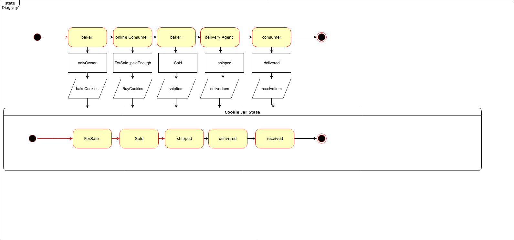
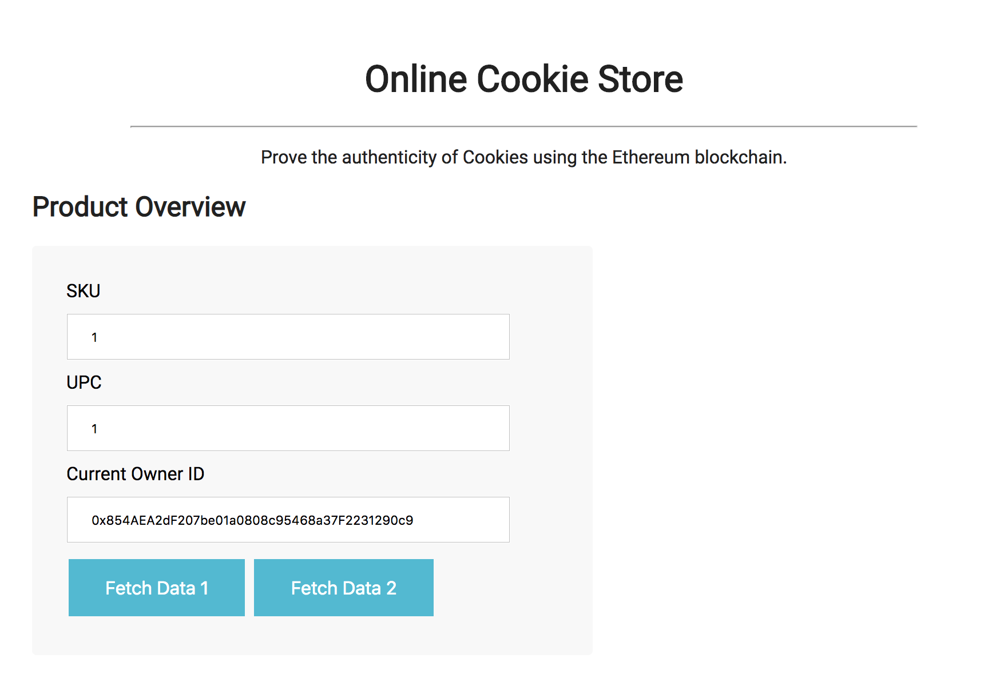
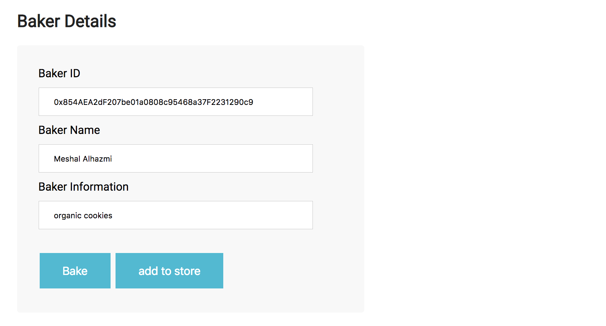
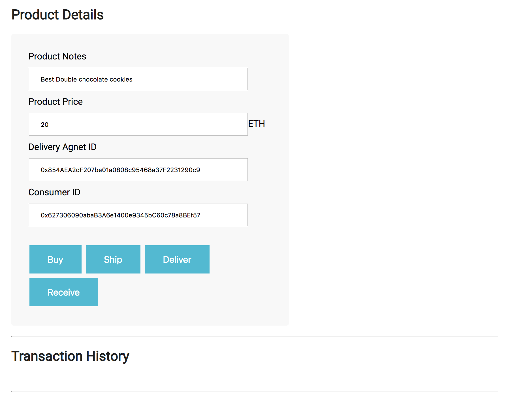

#  UML (planning)

The following UML diagrams explains  the processes and the roles in this projects.


**data Diagram**


**activity Diagram**


**Sequence Diagram**


**state Diagram**


# Libraries
truffle-hdwallet-provider is used to deploy the contract to Rinkeby network
# Contracts and Roles
this project has the following roles
Baker:
- can bake cookies
- add cookies to the online store
- flag item once its ready for shipping
Delivery Agents
- can deliver cookies to customers once the item flagged for shipment
Consumers:
- can verify items delivery by confirming the order as received 

Contract:
Supplychain contract with the following functions
- bakeCookies() allows bakers to recored baked cookies
- addCookieJarToOnlineStore() : allows bakers to add cookies to the online store
- buyCookieJar(): allows conumers to buy cookies
- shipCookieJar(): allows bakers to ship sold cookies
- DeliverCookieJar(): allows delivery agents to deliver cookie jars
- receiveItem(): allows consumers to verify items delivery by confirming the order as received

# Contract Address
below is the smart contract deployment to rinkeby network
```
Using network 'rinkeby'.

Running migration: 1_initial_migration.js
  Deploying Migrations...
  ... 0xbc059d05e00f63fbff9940cb4a876993eb8ad4e79538a0cc6b75958ac23d49f1
  Migrations: 0xc53d950fe92681ff3fc409c1406e96f2e315ac7f
Saving successful migration to network...
  ... 0xe326e4a84aeda0d7880065bd4996f762c3e3d0bde77e182f9c8c2b75bb6c3950
Saving artifacts...
Running migration: 2_deploy_contracts.js
  Deploying BakerRole...
  ... 0xa47197e84bc75bd36d599d152e05618dec606b350bff0d1ff0a6a6e30a4dda87
  BakerRole: 0xf14237966296267cb8c59547d1e605d34e9e04b2
  Deploying DeliveryAgentRole...
  ... 0xba9238fde4e1c136eb10d81c534b8039849938c40687f259de7e3b1d8502df4a
  DeliveryAgentRole: 0x37aff6667b5860523970e64c1ff21b7eefb14e12
  Deploying ConsumerRole...
  ... 0xf174b1833afe3f33da0f7e2e626f8021ef1d22619fc0653007a268ef06ee6057
  ConsumerRole: 0x304ce13bb977ec1f3c47fe8919a537f112986af2
  Deploying SupplyChain...
  ... 0xdd5ddfce34f5624b3d7fdaff56fdf343aec468fe4745d9d4b6ed595a08fc8168
  SupplyChain: 0x4ed79ba4e7a840e2ff681c5e995745f394c9d705
Saving successful migration to network...
  ... 0xd5912f628a8818f37f73d9c78b34847b42e71151078a9a3e5e6c444c0669e4cb
# Supply chain & data auditing
```
SupplyChain contract address is:  https://rinkeby.etherscan.io/address/0x4ed79ba4e7a840e2ff681c5e995745f394c9d705


# Transaction history
UPC :22


Transaction History
Baked - 0x704575e07220e51b994d5ac5b9e6f724809c267ccfc89c740d324a173e2623c1
ForSale - 0xaba6c026c49f5d414f7abc3b2494ed6739e48d04a06fba4393de917739c6586a
Sold - 0x0efc21b6507e371a9a9b9237aae9f2f4197e943601fb020388e7dc9256b0de02
Shipped - 0x5dbfea31a0e5829721167b59feb9b674e78407a8c34681f16180a980bc0f4f20
Delivered - 0x76fa50d0f5965f41036677ee2ddc3d5071f6ad75ee6de67236b45d385618a69f
Received - 0xa484752b2ceca1dd9f4db2aff4f5e55f8047ac028fab40d665f8a4afa66a032d
This repository containts an Ethereum DApp that demonstrates a Supply Chain flow between a Seller and Buyer. The user story is similar to any commonly used supply chain process. A Seller can add items to the inventory system stored in the blockchain. A Buyer can purchase such items from the inventory system. Additionally a Seller can mark an item as Shipped, and similarly a Buyer can mark an item as Received.


## interface
The DApp User Interface when running should look like...







 

## Getting Started

These instructions will get you a copy of the project up and running on your local machine for development and testing purposes. See deployment for notes on how to deploy the project on a live system.

### Prerequisites

Please make sure you've already installed ganache-cli, Truffle and enabled MetaMask extension in your browser.

```
Give examples (to be clarified)
```

### Installing

A step by step series of examples that tell you have to get a development env running

Clone this repository:

```
git clone https://github.com/udacity/nd1309/tree/master/course-5/project-6
```

Change directory to ```project-6``` folder and install all requisite npm packages (as listed in ```package.json```):

```
cd project-6
npm install
```

Launch Ganache:

```
ganache-cli -m "spirit supply whale amount human item harsh scare congress discover talent hamster"
```

Your terminal should look something like this:


In a separate terminal window, Compile smart contracts:

```
truffle compile
```

Your terminal should look something like this:


This will create the smart contract artifacts in folder ```build\contracts```.

Migrate smart contracts to the locally running blockchain, ganache-cli:

```
truffle migrate --network development
```

Your terminal should look something like this:


Test smart contracts:

```
truffle test
```

All 10 tests should pass.


In a separate terminal window, launch the DApp:

```
npm run dev
```

## Built With

* [Ethereum](https://www.ethereum.org/) - Ethereum is a decentralized platform that runs smart contracts
* [IPFS](https://ipfs.io/) - IPFS is the Distributed Web | A peer-to-peer hypermedia protocol
to make the web faster, safer, and more open.
* [Truffle Framework](http://truffleframework.com/) - Truffle is the most popular development framework for Ethereum with a mission to make your life a whole lot easier.


 
## Acknowledgments

* Solidity
* Ganache-cli
* Truffle
* Udacity
